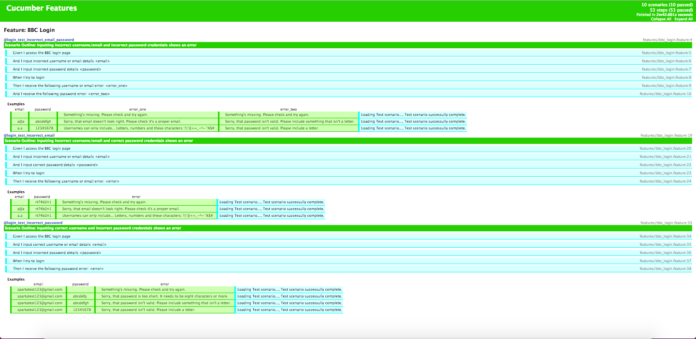
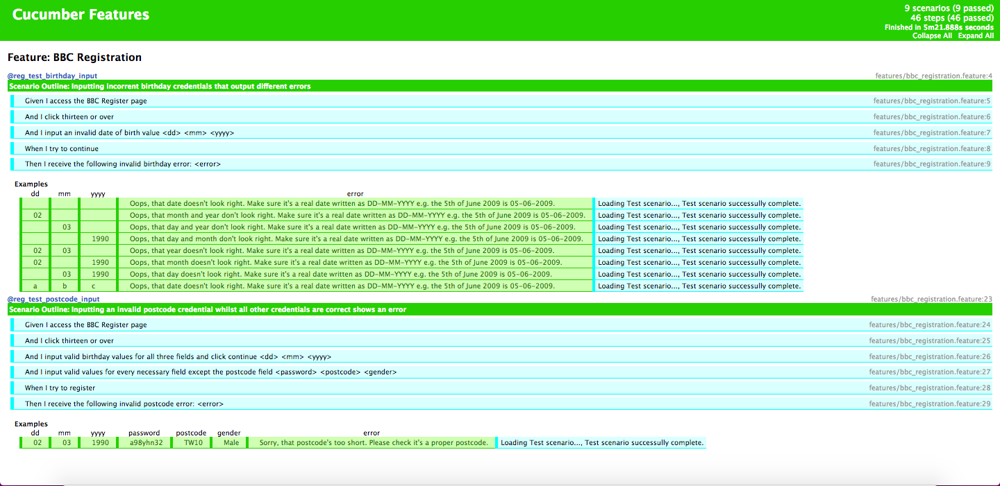

# <p align="center"> Sparta Advanced Cucumber POM </p>

#### Task:

To create an advanced Page Object Model using Cucumber, creating an automated user journey through a website and test for expected failures manipulating Cucumber tables using REGEX and GREP to get data from tables and pass them to the tests, ultimately making code D.R.Y. Also try to include the use of hooks and tags where possible.

This task makes use of:

* Ruby
* Cucumber (for web automation)
* Cucumber tables
* RSpec (for testing)
* [Minute Inbox](https://www.minuteinbox.com)

**How to Download** - click 'clone or download' button, download a zip of our project, unzip, run the following in the terminal to view the automated tests (must be in cucumber-advanced-POM directory):

To run tests for:
* Registration feature tests only -  `cucumber feature/bbc_registration.feature`
* Login feature tests only - `cucumber feature/bbc_login.feature`
* All scenarios/tests (order can be altered by changing tag order) - `cucumber -t @reg_test_birthday_input, @reg_test_postcode_input, @login_test_incorrect_email_password, @login_test_incorrect_email, @login_test_incorrect_password`
* One scenario (change tag for other scenarios) - `cucumber -t @reg_test_birthday_input`

#### Challenges:
Something that I found quite difficult was passing multiple arguments into one test step. Eventually after much research, trial and error, and help from my peers, I was able to provide the following solution to my challenge:

```ruby
# Code Snippet of date of birth arguments on second And step (from bbc_registration.feature file)
@reg_test_birthday_input
Scenario Outline: Inputting incorrent birthday credentials that output different errors
  Given I access the BBC Register page
    And I click thirteen or over
    And I input an invalid date of birth value <dd> <mm> <yyyy>
  When I try to continue
  Then I receive the following invalid birthday error: <error>

  Examples:
  | dd | mm | yyyy | error |
  |  |  |  | Oops, that date doesn't look right. Make sure it's a real date written as DD-MM-YYYY e.g. the 5th of June 2009 is 05-06-2009. |
```

```ruby
# Code Snippet of refactored date of birth method (from bbc_registration.rb file)
def enter_date_of_birth(dd,mm,yyyy)
  fill_in BIRTHDAY_DAY, with: "#{dd}"
  fill_in BIRTHDAY_MONTH, with: "#{mm}"
  fill_in BIRTHDAY_YEAR, with: "#{yyyy}"
  sleep 1
  # arguments are string interpolated to ensure the variables are ouptut as strings
end

# ====== PREVIOUS VERSION OF CODE ======
def choose_birthday_day(day)
    fill_in BIRTHDAY_DAY, with: day
  end

  def choose_birthday_month(month)
    fill_in BIRTHDAY_MONTH, with: month
  end

  def choose_birthday_year(year)
    fill_in BIRTHDAY_YEAR, with: year
    sleep 1
  end
```

```ruby
# Code snippet of step definition using RegEx
Given(/^I input an invalid date of birth value (.*) (.*) (.*)$/) do |dd,mm,yyyy|
  @bbc_site.bbc_registration.enter_date_of_birth(dd,mm,yyyy)
end
```

I also implemented this solution on the @reg_test_postcode_input scenario test, allowing me to also refactor the methods for this test.

### <p align="center"> Login Test Report Screenshot </p>


### <p align="center"> Registration Test Report Screenshot </p>


<hr>

#### Summary:
I am quite pleased with this homework task as it helped to cement my learning regarding:

* TDD (Test Driven Development)
* TDD Cycle - Red/Green/Refactor
* BDD (Behaviour Driven Development)
* The testing process in general (the practical elements)
* Best practices
* The different perspectives that individuals have regarding what test for and the importance of collaboration/collecting different points of view
* Refactoring
* Automated Testing
* How testing might look in the work place
